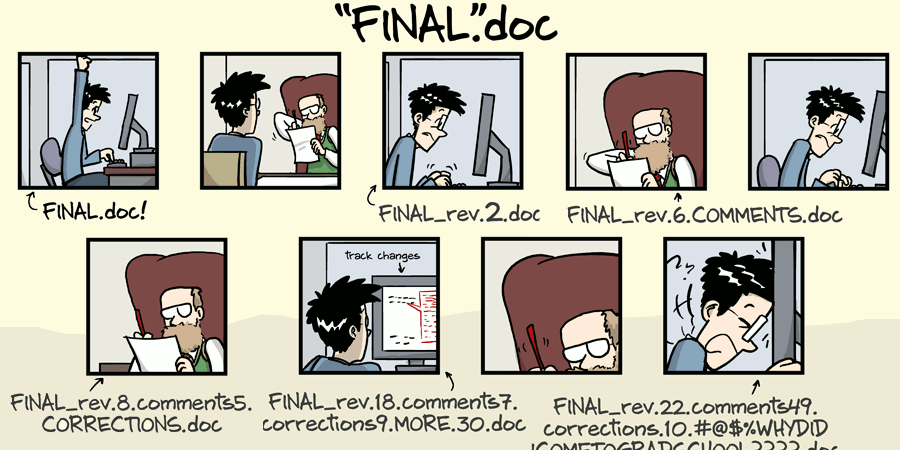
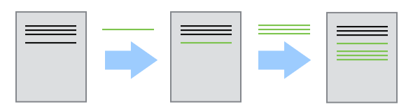
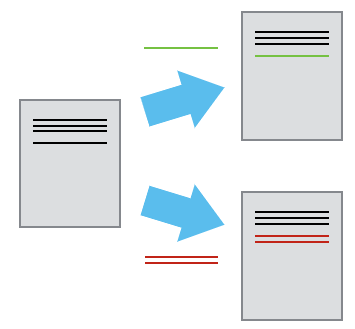
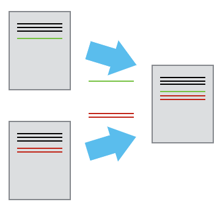
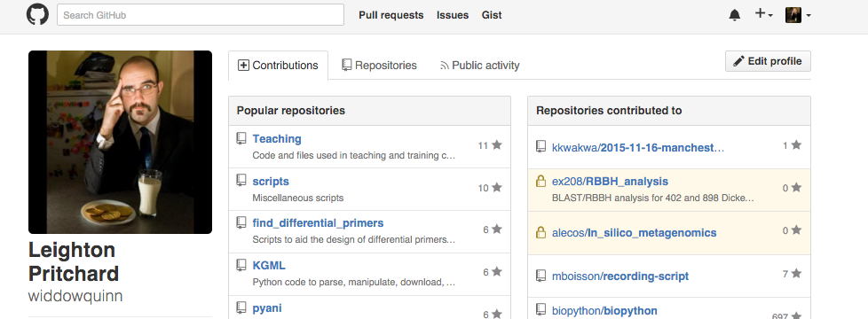
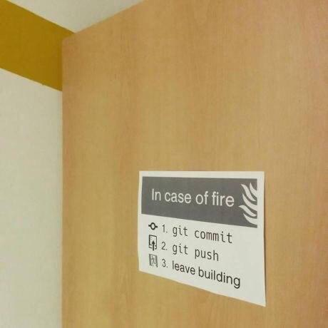
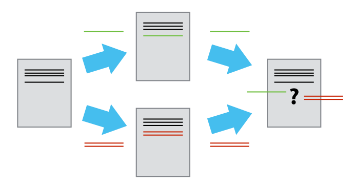
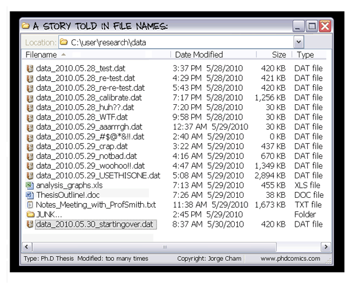

# 2021-04-08 GIT en #yosigopublicando

----

## Os voy a contar una historia...

----

### Hace mucho tiempo...

* Hombre Lobo y Dracula han sido contratados para planear una misión a Marte. 
* Hombre Lobo y Dracula viven en diferentes continentes.
* Trabajan en el mismo plan al mismo tiempo.
* Cómo lo gestionamos?
  * Hacemos turnos para cada archivo?
  * Mandamos copias por email?
* La solución? **Control de versiones** 

----

### Ventajas del Control de versiones

* Nada se pierde una vez que se incluye bajo control de versiones (a menos que lo intentes fuertemente…)
* Sabemos quien y cuando se hicieron cambios
* Se pueden revertir a versiones anteriores.
* Podemos identificar y corregir conflictos

El cuaderno de laboratorio virtual!

---

## Control de versiones con `git`

----

### Que nos queda…?


----

### Objetivos de aprendizaje

* Comprender los beneficios de usar un sistema automático de control de versiones.
* Comprender los fundamentos básicos del funcionamiento de Git.

----

### Reconoces esto?

(p. ej., has trabajado en el mismo documento a la vez que otra persona?)



----

### Cómo funciona el control de versiones

* Control de versiones es como una 'grabación' de la historia



* Rebobina y reproduce los cambios

----

### Múltiples editores (branching)

* Dos personas trabajan en un documento
  * Cada uno hace sus cambios: los documentos divergen
  


* Los cambios se separan del documento

----

### Combinando los cambios (merging)

* Varios cambios se pueden mezclar (*merge*) en el mismo documento base
  * 'Merging'



----

### Lo que hace el sistema de control de versiones

* Los sistemas de control de versiones gestionan el proceso:
   * rastrean los cambios
   * almacenan metadatos (quién, cuándo)
   * guardan 'versiones' (a.k.a. *commits*)
   * dan acceso a cada una de estas versiones

`git` es un sistema de control de versiones (hay más).

---

## Configurando `git`

----

### Objetivos de aprendizaje

* Configurar `git` la primera vez que utilice la computadora.
* Comprender el significado del flag de configuración `--global`.
----

### Configurando opciones globales

* `git` necesita saber quién eres para los metadatos
* `git` quiere saber tus preferencias para mostrar/editar
* queremos configurarlo globalmente

**Presentación**

```
git config --global user.name "Vlad Dracul"
git config --global user.email "vlad@tran.sylvan.ia"
git config --global color.ui "auto"
git config --global core.editor "code --wait"
```

---

## Creando un repositorio

----

### Objetivos de aprendizaje

* Crear un repositorio `git` local
* Qué hay en ese repositorio?
  * archivos
  * commits
  * metadatos

----

### Creando un repositorio `git`

* Un proyecto de ficción sobre planetas
  * (Hombre Lobo y Dracula…)

* Sirve para **todo**: Código, archivos. 
* Recomiendo Markdown y `pandoc`

----

**Presentación**

```
git init
git status
```

---

## Seguimiento de cambios

----

### Objetivos de aprendizaje

* Practicar el ciclo `modify-add-commit`
* Entender dónde se guarda la información dentro del flujo de trabajo de `git`

----

### Mi primer archivo sin seguimiento

* Vamos a crear un archivo, pero no haremos nada. 
  * "Es Marte adecuado como base espacial?" 

**Presentación**

```
code Marte.txt
```

----

### Mi primer `git commit`
<!-- Scoped style -->
<style scoped>
blockquote {
  size: 13pt;
  text-align: left;
}
</style>

#### com•mit  (kə mit′),
>   to give in trust or charge; consign.
>   to consign for preservation:
>   > to commit ideas to writing; to commit a poem to memory.

**remitir**

----

### Mi primer `git commit`

* Decimos a `git` que *siga* un archivo (vigile para cambios): `git add`
* También hacemos `git commit` al archivo (guarda una copia del archivo en el *repositorio*, en su estado actual)

**Presentación**
```
git add Marte.txt
git commit -m "start notes on Marte as a base"
git log
```

----

### El área de preparación (*staging area*)

* No siempre queremos hacer un "commit" de los cambios
* El *staging area* contiene los cambios que no queremos hacer "commit".
  * (otros archivos que también se han cambiado, pero que no queremos remitir)
  


----

### modify-add-commit

* Ahora queremos añadir más información al archivo. 
  * Modificamos el archivo
  * Añadimos el archivo al *staging area* (`git add`)
  * Remitimos los cambios (`git commit`) 

**Presentación**

```
code Marte.txt
git diff
git add Marte.txt
git diff
git commit
```

----

### Pregunta

-  Qué comando(s) guardarán los cambios de `myfile.txt` al repositorio `git` local?


1. `git commit -m "cambios recientes"`
2. `git init myfile.txt; git commit -m "cambios recientes"`
3. `git add myfile.txt; git commit -m "cambios recientes"`
4. `git commit -m myfile.txt "cambios recientes"`


----

### Reto 1 (5min)

* Hacer un cambio de una línea a `Marte.txt`.
* Crear el archivo `Tierra.txt` con un comentario de una línea. 
* Remitir los dos cambios (*como **un sólo*** `commit`)


----

### El ciclo de vida modify-add-commit


----

### In which I predict the future…


---

## Exploring history

----

### Is history bunk?

* How can I identify old versions of files?
* How do I review changes between commits?
* How can I recover old file versions?

----

### Objetivos de aprendizaje

* Understand what the `HEAD` of a repository is
* Identify and use `git` commit numbers
* Compare various versions of tracked files
* Restore old versions of files

----

### Commit history

* Most recent commit: `HEAD`
* Next-most recent: `HEAD~1`
* Next-next-most recent: `HEAD~2`


----

### History with `git diff`

* We can use `git diff` to see what changed for a file at each commit

**Presentación**

```
git diff HEAD~1..HEAD Marte.txt
git diff HEAD~2..HEAD~1 Marte.txt
```

----

### History with `git diff`

* We can also compare the working copy with `HEAD`, or with any commit

**Presentación**

```
git diff
git diff HEAD~2
```

----

### History with commit IDs

* We can use the unique ID for a commit in the same way

**Presentación**

```
git diff d22195b9ec3c8fb4c2ce0f52f344b95ce5d0d0e3 Marte.txt
git diff d221 Marte.txt
```

----

### Restoring older versions

* How can we restore older versions/backtrack?
* Let's say we accidentally overwrite a file…

**Presentación**

```
git checkout HEAD Marte.txt 
```

----

### `git checkout`

* `git checkout` "checks out" files from the repo
  * Can use any commit identifier
  * Check out the commit *before* the edit you want to replace!


----

### Question

- Which command(s) below will let Jennifer recover the last committed version of her Python script called `data_cruncher.py` (but no other files)?


1. `$ git checkout HEAD`
2. `$ git checkout HEAD data_cruncher.py`
3. `$ git checkout HEAD~1 data_cruncher.py`
4. `$ git checkout <unique ID of last commit> data_cruncher.py`

---

## Ignoring things

----

### Objetivos de aprendizaje

* Configure `git` to ignore files and directories
* Understand why this is useful

----

### Not all files are useful

* Editor backup files
* Temporary files
* Intermediate analysis files

**Presentación**

```
mkdir results
touch a.dat results/a.out
```

----

### `.gitignore`

* `.gitignore` is a special file in your repository root 
  * It tells `git` to ignore specified files/directories
  * It should be committed in your repository

**Presentación**

```
code .gitignore
git status --ignored
git add -f b.dat
```

---

## Remotes in GitHub

----

### Objetivos de aprendizaje

* What remote repositories are and why they are useful
* To clone a remote repository
* To push to and pull from a remote repository

----

### Remote repositories

* Control de versiones most useful for collaboration
  * Easiest to have a single repository
  * Repository may be hosted off-site (for at least one collaborator)
* Services available:
  * GitHub, BitBucket, GitLab
* We're using GitHub

----

### GitHub Saved My Life!


----

### Log in to GitHub

* Register for an account, if you don't have one - then log in



----

### Create a remote repository

* Essentially, on GitHub's servers:

```
mkdir planets
cd planets
git init
``` 

**Presentación**

----

### A freshly-made GitHub repository

* There's nothing in the remote repository!


----

### Connecting local and remote repositories

* We tell the *local* repository that the GitHub repository is its *remote* repository.
  * `origin` is a local nickname for the remote repo (a common choice)
  * Once set up, we *push* changes/history to the remote repo

**Presentación**

```
git remote add origin https://github.com/widdowquinn/planets.git
git push origin master
```

----

### Remote GitHub repo after first *push*

* We only *push* the repository, not the staging area


----

### My first remote *pull*

* To synchronise the local repo with the remote repo, we *pull*

**Presentación**

```
git pull origin master
```

---

## Colaboración en GitHub

----

### Objetivos de aprendizaje

* Collaborate pushing changes to someone else's remote repository

----

### Starting a collaboration

* Pair up as 'owner' and 'collaborator'
* as *owner*: give GitHub repo access to your collaborator
* as *collaborator*: clone the *owner*'s repo

**Presentación**

```
cd /tmp/
git clone https://github.com/<collaborator>/planets.git
git remote -v
```

----

### Make a collaborative change

**as the *collaborator* **

* Add a file called `pluto.txt` - (content your own)

**Presentación**

```
cd planets
code pluto.txt
git add pluto.txt
git commit -m "Notes on Pluto"
git push origin master
```

----

### Pull a collaborator's change

**as the *owner* **

* Change back to your **own** repository
  * Check with `git remote -v`
* `git pull` the changes made by your collaborator

**Presentación**

```
cd ~/planets/
git pull origin master
```

---

## Resolviendo conflictos `git`

----

### Objetivos de aprendizaje

* Explicar qué son los conflictos y cuándo pueden ocurrir.
* Resolver conflictos que resultan de una fusión.

----

### Por qué ocurren los conflictos

* Gente trabajando en paralelo
  * cambios diferentes a la misma parte de un archivo
  * no tener sincronizado el repo local antes de hacer cambios locales
  * no tener sincronizado el repo remoto después de hacer cambios locales
* `git pull` antes; `git push` cuando acabes

----

### En serio, `git push` cuando acabes...



----

### Vamos a crear un conflicto

* Como *owner*: añade una línea `Marte.txt`
  * `commit` el cambio y `push`


* Como *collaborator*: añade una línea a `Marte.txt`
  * `commit` el cambio y `push`

**Presentación**

```
cd ~/planetas
code Marte.txt
git push origin master
cd /tmp/planetas
code Marte.txt
git push origin master
```

----

### El mensaje de conflicto (*conflict*)

```
To https://github.com/<collaborator>/planetas.git
 ! [rejected]        master -> master (fetch first)
error: failed to push some refs to 'https://github.com/<collaborator>/planets.git'
hint: Updates were rejected because the remote contains work that you do
hint: not have locally. This is usually caused by another repository pushing
hint: to the same ref. You may want to first integrate the remote changes
hint: (e.g., 'git pull ...') before pushing again.
hint: See the 'Note about fast-forwards' in 'git push --help' for details.
```

----

### Los cambios conflictivos



----

### Resolver un conflicto

* `git` detecta cambios superpuestos
  * `git` deja a los humanos resolver: **comunicaos**!
  
* Para resolver:
  * *pull* cambios remotos
  * *merge* cambios en la *working copy*
  * *push* los cambios *merged*
  
**Presentación**

---

## Resumiendo

* GitHub y Control de versiones puede ser un cuaderno de laboratorio electrónico, parte del paradigma de *Open Science* (OS)
  * Almacena datos - guarda en repositorio OA (Zenodo/FigShare)
  * Usa GitHub para almacenar trabajo en curso: análisis de laboratorio
  * Envía el preprint a (Bio)arXiv
* Incluso si no te gusta el *OS*, es más reproducible (y auditable)

----

### Ya estás preparado para dejar esto atrás…


