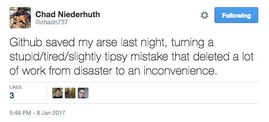

# 2021-04-08 GIT en #yosigopublicando

----

## Os voy a contar una historia...

----

### Hace mucho tiempo...

* Hombre Lobo y Dracula han sido contratados para planear una misión a Marte. 
* Hombre Lobo y Dracula viven en diferentes continentes.
* Trabajan en el mismo plan al mismo tiempo.
* Cómo lo gestionamos?
  * Hacemos turnos para cada archivo?
  * Mandamos copias por email?
* La solución? **Control de versiones** 

----

### Ventajas del Control de versiones

* Nada se pierde una vez que se incluye bajo control de versiones (a menos que lo intentes fuertemente…)
* Sabemos quien y cuando se hicieron cambios
* Se pueden revertir a versiones anteriores.
* Podemos identificar y corregir conflictos

El cuaderno de laboratorio virtual!

---

### Disclaimer
* La terminología de git está en inglés. En algunos casos he intentado traducir los comandos, si estos ayudan a entender. En la práctica nadie usa los términos en castellano. Se me pueden escapar... mucho. 
* Vamos a usar la versión de línea de comandos que es universal y permite entenderlo bien. Luego hay muchas opciones más fáciles. 

---

## Control de versiones con `git`

----

### Que nos queda…?


----

### Objetivos de aprendizaje

* Comprender los beneficios de usar un sistema automático de control de versiones.
* Comprender los fundamentos básicos del funcionamiento de Git.

----

### Reconoces esto?

(p. ej., has trabajado en el mismo documento a la vez que otra persona?)


----

### Cómo funciona el control de versiones

* Control de versiones es como una 'grabación' de la historia


* Rebobina y reproduce los cambios

----

### Múltiples editores (branching)

* Dos personas trabajan en un documento
  * Cada uno hace sus cambios: los documentos divergen
  


* Los cambios se separan del documento

----

### Combinando los cambios (merging)

* Varios cambios se pueden mezclar (*merge*) en el mismo documento base
  * 'Merging'


----

### Lo que hace el sistema de control de versiones

* Los sistemas de control de versiones gestionan el proceso:
   * rastrean los cambios
   * almacenan metadatos (quién, cuándo)
   * guardan 'versiones' (a.k.a. *commits*)
   * dan acceso a cada una de estas versiones

`git` es un sistema de control de versiones (hay más).

---

## Configurando `git`

----

### Objetivos de aprendizaje

* Configurar `git` la primera vez que utilice la computadora.
* Comprender el significado del flag de configuración `--global`.
----

### Configurando opciones globales

* `git` necesita saber quién eres para los metadatos
* `git` quiere saber tus preferencias para mostrar/editar
* queremos configurarlo globalmente

**Presentación**

```
git config --global user.name "Vlad Dracul"
git config --global user.email "vlad@tran.sylvan.ia"
git config --global color.ui "auto"
git config --global core.editor "code --wait"
```

---

## Creando un repositorio

----

### Objetivos de aprendizaje

* Crear un repositorio `git` local
* Qué hay en ese repositorio?
  * archivos
  * commits
  * metadatos

----

### Creando un repositorio `git`

* Un proyecto de ficción sobre planetas
  * (Hombre Lobo y Dracula…)

* Sirve para **todo**: Código, archivos. 
* Recomiendo Markdown y `pandoc`

----

**Presentación**

```
git init
git status
```

---

## Seguimiento de cambios

----

### Objetivos de aprendizaje

* Practicar el ciclo `modify-add-commit`
* Entender dónde se guarda la información dentro del flujo de trabajo de `git`

----

### Mi primer archivo sin seguimiento

* Vamos a crear un archivo, pero no haremos nada. 
  * "Es Marte adecuado como base espacial?" 

**Presentación**

```
code Marte.txt
```

----

### Mi primer `git commit`
<!-- Scoped style -->
<style scoped>
blockquote {
  size: 13pt;
  text-align: left;
}
</style>

#### com•mit  (kə mit′),
>   to give in trust or charge; consign.
>   to consign for preservation:
>   > to commit ideas to writing; to commit a poem to memory.

**remitir**

----

### Mi primer `git commit`

* Decimos a `git` que *siga* un archivo (vigile para cambios): `git add`
* También hacemos `git commit` al archivo (guarda una copia del archivo en el *repositorio*, en su estado actual)

**Presentación**
```
git add Marte.txt
git commit -m "start notes on Marte as a base"
git log
```

----

### El área de preparación (*staging area*)

* No siempre queremos hacer un "commit" de los cambios
* El *staging area* contiene los cambios que no queremos hacer "commit".
  * (otros archivos que también se han cambiado, pero que no queremos remitir)
  


----

### modify-add-commit

* Ahora queremos añadir más información al archivo. 
  * Modificamos el archivo
  * Añadimos el archivo al *staging area* (`git add`)
  * Remitimos los cambios (`git commit`) 

**Presentación**

```
code Marte.txt
git diff
git add Marte.txt
git diff
git commit
```

----

### Pregunta

-  Qué comando(s) guardarán los cambios de `myfile.txt` al repositorio `git` local?


1. `git commit -m "cambios recientes"`
2. `git init myfile.txt; git commit -m "cambios recientes"`
3. `git add myfile.txt; git commit -m "cambios recientes"`
4. `git commit -m myfile.txt "cambios recientes"`


----

### Reto 1 (5min)

* Hacer un cambio de una línea a `Marte.txt`.
* Crear el archivo `Tierra.txt` con un comentario de una línea. 
* Remitir los dos cambios (*como **un sólo*** `commit`)


----

### El ciclo de vida modify-add-commit


----

### En el que predecimos el futuro...


---

## Explorando el historial

----

### Es el historial una chorrada?

* Cómo identificar versiones antiguas de archivos?
* Cómo reviso los cambios entre `commits`?
* Cómo recupero versiones antiguas?

----

### Objetivos de aprendizaje

* Entender qué es el `HEAD` de un repositorio
* Identificar y usar los números `git commit` 
* Comparar varias veriones de archivos en seguimiento
* Restaurar versiones antiguas de archivos

----

### Historial de commits

* El más reciente: `HEAD`
* El siguiente más reciente: `HEAD~1`
* El siguiente al siguiente más reciente: `HEAD~2`


----

### Historial con `git diff`

* Podemos usar `git diff` para ver qué ha cambiado en un archivo para cada `commit`

**Presentación**

```
git diff HEAD~1..HEAD Marte.txt
git diff HEAD~2..HEAD~1 Marte.txt
```

----

### Historial con `git diff`

* También podemos comparar la copia actual (*working copy*) con `HEAD`, o con cualquier otro `commit`. 

**Presentación**

```
git diff
git diff HEAD~2
```

----

### Historial con IDs de commit

* Podemos utilizar el identificador único para un `commit` de la misma forma.

**Presentación**

```
git diff d22195b9ec3c8fb4c2ce0f52f344b95ce5d0d0e3 Marte.txt
git diff d221 Marte.txt
```

----

### Historial con IDs de commit

* En github: 


----

### Restaurando versiones antiguas

* Cómo podemos restaurar versiones antiguas?
* Imagina que sobreescribimos un archivo de forma "accidental"...

**Presentación**

```
git checkout HEAD Marte.txt 
```

----

### `git checkout`

* `git checkout` "comprueba" archivos del repo
  * Puede usar cualquier commit ID
  * Comprueba el commit *antes* de la edición que quieres reemplazar!


----

### Pregunta

- Qué comando(s) harán que Manuela recupere la última versión remitida de su script `exprimir_datos.py` (pero ningún otro archivo)?


1. `$ git checkout HEAD`
2. `$ git checkout HEAD exprimir_datos.py`
3. `$ git checkout HEAD~1 exprimir_datos.py`
4. `$ git checkout <unique ID of last commit> exprimir_datos.py`

---

## Ignorando cosas

----

### Objetivos de aprendizaje

* Configurar `git` para que ignore archivos y directorios
* Entender por qué es útil

----

### No todos los archivos son útiles

* Archivos de copia de seguridad del editor
* Archivos temporales
* Archivos intermedios de análisis

**Presentación**

```
mkdir results
touch a.dat results/a.out
```

----

### `.gitignore`

* `.gitignore` es un archivo especial en la raíz del repositorio
  * Le dice a `git` que ignore los archivos/carpetas especificados
  * Debe estar remitido en el repositorio

**Presentación**

```
code .gitignore
git status --ignored
git add -f b.dat
```

---

## Trabajando en remoto

----

### Objetivos de aprendizaje

* Qué son los repositorios remotos y por qué son útiles
* Clonar un repositorio remoto
* Hacer `push` y `pull` en un repositorio remoto

----

### Repositorios remotos

* El control de versiones es muy útil para colaborar
  * Es más fácil tener un sólo repositorio
  * Se puede alojar offline (para un solo colaborador)
* Servicios disponibles:
  * GitHub, BitBucket, GitLab
* Usaremos GitHub

----

### GitHub Saved My Life!



----

### Entrar a GitHub

* Regístrate para una cuenta, si no tienes una - luego entra.


----

### Crear un repositorio remoto

* Esencialemnte, en los servidores de GitHub:

**Presentación**
```
mkdir planetas
cd planetas
git init
``` 


----

### Un repositorio de GitHub nuevecico!

* No hay nada en el repositorio remoto!


----

### Conectando el repo local y remoto

* Le decimos al repo *local* que el de Github es su repositorio *remoto*.
  * `origin` es el apodo local para el repositorio remoto (una elección habitual)
  * Una vez que lo hacemos, empujamos (*push*) los cambios/historial al repositorio remoto

**Presentación**

```
git remote add origin https://github.com/pakitochus/planets.git
git push origin master
```

----

### Remote GitHub repo after first *push*

* We only *push* the repository, not the staging area


----

### My first remote *pull*

* To synchronise the local repo with the remote repo, we *pull*

**Presentación**

```
git pull origin master
```

---

## Colaboración en GitHub

----

### Objetivos de aprendizaje

* Collaborate pushing changes to someone else's remote repository

----

### Starting a collaboration

* Pair up as 'owner' and 'collaborator'
* as *owner*: give GitHub repo access to your collaborator
* as *collaborator*: clone the *owner*'s repo

**Presentación**

```
cd /tmp/
git clone https://github.com/<collaborator>/planets.git
git remote -v
```

----

### Make a collaborative change

**as the *collaborator* **

* Add a file called `pluto.txt` - (content your own)

**Presentación**

```
cd planets
code pluto.txt
git add pluto.txt
git commit -m "Notes on Pluto"
git push origin master
```

----

### Pull a collaborator's change

**as the *owner* **

* Change back to your **own** repository
  * Check with `git remote -v`
* `git pull` the changes made by your collaborator

**Presentación**

```
cd ~/planets/
git pull origin master
```

---

## Resolviendo conflictos `git`

----

### Objetivos de aprendizaje

* Explicar qué son los conflictos y cuándo pueden ocurrir.
* Resolver conflictos que resultan de una fusión.

----

### Por qué ocurren los conflictos

* Gente trabajando en paralelo
  * cambios diferentes a la misma parte de un archivo
  * no tener sincronizado el repo local antes de hacer cambios locales
  * no tener sincronizado el repo remoto después de hacer cambios locales
* `git pull` antes; `git push` cuando acabes

----

### En serio, `git push` cuando acabes...


----

### Vamos a crear un conflicto

* Como *owner*: añade una línea `Marte.txt`
  * `commit` el cambio y `push`


* Como *collaborator*: añade una línea a `Marte.txt`
  * `commit` el cambio y `push`

**Presentación**

```
cd ~/planetas
code Marte.txt
git push origin master
cd /tmp/planetas
code Marte.txt
git push origin master
```

----

### El mensaje de conflicto (*conflict*)

```
To https://github.com/<collaborator>/planetas.git
 ! [rejected]        master -> master (fetch first)
error: failed to push some refs to 'https://github.com/<collaborator>/planets.git'
hint: Updates were rejected because the remote contains work that you do
hint: not have locally. This is usually caused by another repository pushing
hint: to the same ref. You may want to first integrate the remote changes
hint: (e.g., 'git pull ...') before pushing again.
hint: See the 'Note about fast-forwards' in 'git push --help' for details.
```

----

### Los cambios conflictivos


----

### Resolver un conflicto

* `git` detecta cambios superpuestos
  * `git` deja a los humanos resolver: **comunicaos**!
  
* Para resolver:
  * *pull* cambios remotos
  * *merge* cambios en la copia actual (*working copy*)
  * *push* los cambios *merged*
  
**Presentación**

---

## Resumiendo

* GitHub y Control de versiones puede ser un cuaderno de laboratorio electrónico, parte del paradigma de *Open Science* (OS)
  * Almacena datos - guarda en repositorio OA (Zenodo/FigShare)
  * Usa GitHub para almacenar trabajo en curso: análisis de laboratorio
  * Envía el preprint a (Bio)arXiv
* Incluso si no te gusta el *OS*, es más reproducible (y auditable)

----

### Ya estás preparado para dejar esto atrás…


