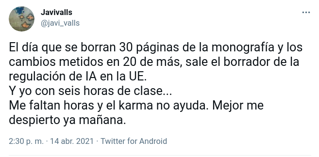
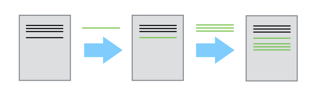
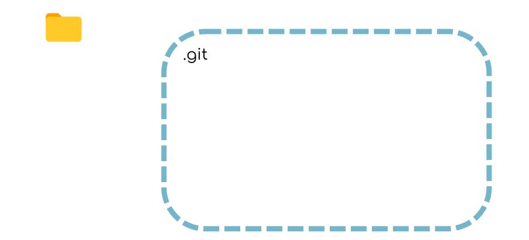
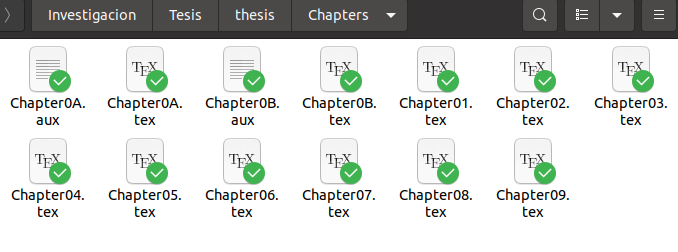
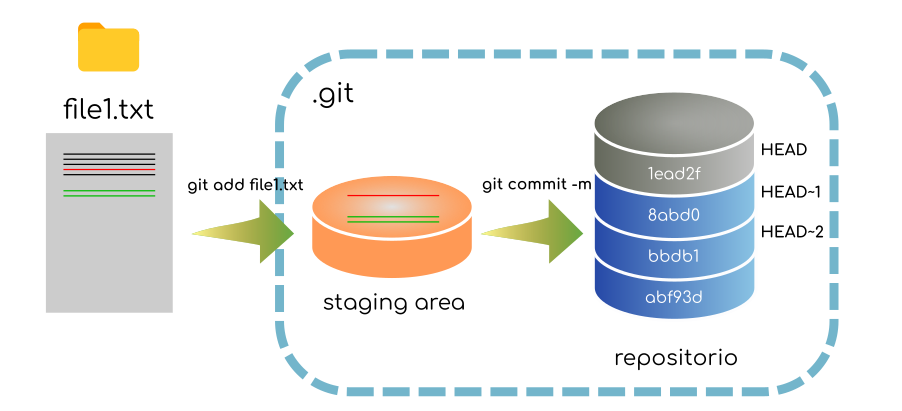

## Git y Github para investigación
#### F. J. Martinez-Murcia


----

## Os voy a contar una historia...


----

### Hace mucho tiempo...

* Hombre Lobo y Dracula han sido contratados para planear una misión a Marte. 
* Hombre Lobo y Dracula viven en diferentes continentes.
* Trabajan en el mismo plan al mismo tiempo.
* Cómo lo gestionamos?
  * Hacemos turnos para cada archivo y mandamos copias por email?
  * Usamos google docs?

----

### ¿Y si tuvieran que diseñar la herramienta?
* Que nada se pierda: poder navegar hacia atrás y adelante en el tiempo. 
* Identificar quién y cuando se han hecho cambios. 
* Identificar conflictos
* Tener todo centralizado y disponible

---
<!--
_backgroundColor: blue
_color: white
-->
### Disclaimer
* La terminología de git está en inglés. En algunos casos he intentado traducir los comandos, si estos ayudan a entender. En la práctica nadie usa los términos en castellano. Se me pueden escapar... mucho. 
* Vamos a usar la versión de línea de comandos que es universal y permite entenderlo bien. Luego hay muchas opciones más fáciles. 

---

## Control de versiones con `git`

----

### Reconoces esto?


----

### O esto?



----

### Objetivos de aprendizaje

* Comprender los beneficios de usar un sistema automático de control de versiones.
* Comprender los fundamentos básicos del funcionamiento de Git.

----

### Cómo funciona el control de versiones

* Control de versiones es como una 'grabación' de la historia



* Rebobina y reproduce los cambios

----

### Múltiples editores (branching)

* Dos personas trabajan en un documento
  * Cada uno hace sus cambios: los documentos divergen
  * Los cambios se separan del documento
  


----

### Combinando los cambios (merging)

* Varios cambios se pueden mezclar (*merge*) en el mismo documento base
  * 'Merging'


----

### Lo que hace el sistema de control de versiones

* Los sistemas de control de versiones gestionan el proceso:
   * rastrean los cambios
   * almacenan metadatos (quién, cuándo)
   * guardan 'versiones' (a.k.a. *commits*)
   * dan acceso a cada una de estas versiones

`git` es un sistema de control de versiones (hay más).

---

## Configurando `git`

----

### Objetivos de aprendizaje

* Configurar `git` la primera vez que utilice la computadora.
* Comprender el significado del flag de configuración `--global`.
----

### Configurando opciones globales

* `git` necesita saber quién eres para los metadatos
* `git` quiere saber tus preferencias para mostrar/editar
* queremos configurarlo globalmente

**Presentación**

```
git config --global user.name "Vlad Dracul"
git config --global user.email "vlad@tran.sylvan.ia"
git config --global core.editor "gedit --wait"
```

---

## Creando un repositorio

----

### Objetivos de aprendizaje

* Crear un repositorio `git` local
* Qué hay en ese repositorio?
  * archivos
  * commits
  * metadatos

----

### Creando un repositorio `git`

* Misión a marte de Hombre Lobo y Drácula
* Sirve para **todo**: Código, documentos de texto. 
* Recomiendo Markdown y `pandoc`

----

**Presentación**

```
mkdir planetas
cd planetas
git init
git status
```

----
### Creando un repositorio `git`


---

## Seguimiento de cambios

----

### Objetivos de aprendizaje

* Practicar el ciclo `modify-add-commit`
* Entender dónde se guarda la información dentro del flujo de trabajo de `git`
* Distinguir entre mensajes descriptivos y no-descriptivos de un commit.

----

### Mi primer archivo sin seguimiento

* Vamos a crear un archivo, pero no haremos nada. 
  * Drácula: "Frío y seco, pero todo es de mi color favorito" 

**Presentación**

```
gedit Marte.txt
git status
```

---- 
### Modificar


----

### Qué es `git commit`?
<!-- Scoped style -->
<style scoped>
blockquote {
  size: 13pt;
  text-align: left;
}
</style>

#### com•mit  (kə mit′),
>   to give in trust or charge; consign.
>   to consign for preservation:
>   > to commit ideas to writing; to commit a poem to memory.

----

### Mi primer `git commit`

* También hacemos `git commit` al archivo (guarda una copia del archivo en el *repositorio*, en su estado actual)

**Presentación**
```
git add Marte.txt
git commit -m "añadir anotaciones de Marte como base"
git log
```

---- 

### Por qué git add? 
* No siempre queremos hacer un commit de todas las modificaciones
* Hacer commit de nuestros cambios en etapas y capturarlos en porciones lógicas en lugar de solo lotes grandes.



---- 
### Añadir: `git add`


----
  
### Commit: `git commit -m`


----

### El área de preparación (*staging area*)

* El *staging area* contiene los cambios que no queremos hacer "commit".
  * (otros archivos que también se han cambiado, pero que no queremos remitir)

----
  
### El área de preparación


----

### modify-add-commit

* Ahora queremos añadir más información al archivo. 
  * Modificamos el archivo
  * Añadimos el archivo al *staging area* (`git add`)
  * Remitimos los cambios (`git commit`) 

**Presentación**

```
gedit Marte.txt
git diff
git add Marte.txt
git commit
```

----

### Pregunta

-  Qué comando(s) guardarán los cambios de `myfile.txt` al repositorio `git` local?


1. `git commit -m "cambios recientes"`
2. `git init myfile.txt; git commit -m "cambios recientes"`
3. `git add myfile.txt; git commit -m "cambios recientes"`
4. `git commit -m myfile.txt "cambios recientes"`


----

### Reto 1 (5min)

* Hacer un cambio de una línea a `Marte.txt`.
* Crear el archivo `Tierra.txt` con un comentario de una línea. 
* Remitir los dos cambios (*como **un sólo*** `commit`)


----

### En el que predecimos el futuro...


---

## Explorando el historial

----

### Es el historial una chorrada?

* Cómo identificar versiones antiguas de archivos?
* Cómo reviso los cambios entre `commits`?
* Cómo recupero versiones antiguas?

----

### Objetivos de aprendizaje

* Entender qué es el `HEAD` de un repositorio
* Identificar y usar los números `git commit` 
* Comparar varias veriones de archivos en seguimiento
* Restaurar versiones antiguas de archivos

----

### Historial de commits

* El más reciente: `HEAD`
* El siguiente más reciente: `HEAD~1`
* El siguiente al siguiente más reciente: `HEAD~2`


----

### Historial de commits




----


### Historial con `git diff`

* Podemos usar `git diff` para ver qué ha cambiado en un archivo para cada `commit`

**Presentación**

```
git diff HEAD~1..HEAD Marte.txt
git diff HEAD~2..HEAD~1 Marte.txt
```

----

### Historial con `git diff`

* También podemos comparar la copia actual (*working copy*) con `HEAD`, o con cualquier otro `commit`. 

**Presentación**

```
git diff
git diff HEAD~2
```

----

### Working copy!


----

### Historial con IDs de commit

* Podemos utilizar el identificador único para un `commit` de la misma forma.

**Presentación**

```
git diff d22195b9ec3c8fb4c2ce0f52f344b95ce5d0d0e3 Marte.txt
git diff d221 Marte.txt
```


----

### Restaurando versiones antiguas

* Cómo podemos restaurar versiones antiguas?
* Imagina que sobreescribimos un archivo de forma "accidental"...

**Presentación**

```
git checkout HEAD Marte.txt 
```

----

### `git checkout`


----

### `git checkout`

* `git checkout` "comprueba" archivos del repo
  * Puede usar cualquier commit ID
  * Comprueba el commit *antes* de la edición que quieres reemplazar!


----

### Pregunta

- Qué comando(s) harán que Manuela recupere la última versión remitida de su script `exprimir_datos.py` (pero ningún otro archivo)?


1. `$ git checkout HEAD`
2. `$ git checkout HEAD exprimir_datos.py`
3. `$ git checkout HEAD~1 exprimir_datos.py`
4. `$ git checkout <ID único del último commit> exprimir_datos.py`

---

## Ignorando cosas

----

### Objetivos de aprendizaje

* Configurar `git` para que ignore archivos y directorios
* Entender por qué es útil

----

### No todos los archivos son útiles

* Archivos de copia de seguridad del editor
* Archivos temporales
* Archivos intermedios de análisis

**Presentación**

```
mkdir results
touch a.dat results/a.out
```

----

### `.gitignore`

* `.gitignore` es un archivo especial en la raíz del repositorio
  * Le dice a `git` que ignore los archivos/carpetas especificados
  * Debe estar remitido en el repositorio

**Presentación**

```
gedit .gitignore
git status --ignored
git add -f b.dat
```

---

## Trabajando en remoto

----

### Objetivos de aprendizaje

* Qué son los repositorios remotos y por qué son útiles
* Hacer `push` y `pull` en un repositorio remoto

----

### Repositorios remotos

* El control de versiones es muy útil para colaborar
  * Es más fácil tener un sólo repositorio
  * Se puede alojar offline (para un solo colaborador)
* Servicios disponibles:
  * GitHub, BitBucket, GitLab
* Usaremos GitHub

----

### GitHub Saved My Life!


----

### Entrar a GitHub

* Regístrate para una cuenta, si no tienes una - luego entra.


----

### Crear un repositorio remoto

**Presentación**

* Esencialmente, en los servidores de GitHub:
```
mkdir planetas
cd planetas
git init
``` 


----

### Un repositorio de GitHub nuevecico!

* No hay nada en el repositorio remoto!


----

### Conectando el repo local al remoto

* Le decimos al repo *local* que el de Github es su repositorio *remoto*.
  * `origin` es el apodo local para el repositorio remoto (una elección habitual)
  * Una vez que lo hacemos, empujamos (*push*) los cambios/historial al repositorio remoto

**Presentación**

```
git remote add origin https://github.com/pakitochus/planets.git
git push origin master
```

----

### El GitHub remoto tras el primer *push*

* Sólo hemos hecho *push* del repositorio, no de la *staging area*


----

### Mi primer *pull* remoto

* Para sincronizar el repo local con el remoto, hacemos *pull* (tiramos)

**Presentación**

```
git pull origin master
```
----

### Mi primer `pull`


----

### Historial con IDs de commit

* En github: 


---

## Trabajos en colaboración

----

### Objetivos de aprendizaje
* Clonar un repositorio remoto.
* Colaborar en crear un repositorio común.

----

### Comenzar una colaboración

* Colaboración! Necesito 3 o 4 voluntarios! 
* Roles: 'owner' (propietario), 'collaborator' (colaborador). 
* Como *propietario*: dar acceso GitHub a tus colaboradores
* Como *collaborador*: clonar el repo del *propietario*

**Presentación**

```
cd /tmp/
git clone https://github.com/<propietario>/planetas.git
```

----

### Hacer cambios colaborativos

* **El *colaborador***:

* Añade un archivo con nombre de planeta `*.txt`: 

**Presentación**

```
cd planetas
gedit <planeta>.txt
git add <planeta>.txt
git commit -m "Notas sobre <inserte planeta aqui>"
git push origin master
```
----

### `Push` de cambios de colaboradores


----

### `Pull` de cambios de un colaborador

* **El *propietario***

* Comprueba con `git remote -v`
* Haz `git pull` para traer los cambios de tu colaborador

**Presentación**

```
cd ~/planetas/
git pull origin master
```

---

## Conflictos

----

### Objetivos de aprendizaje

* Explicar qué son los conflictos y cuándo pueden ocurrir.
* Resolver conflictos que resultan de una fusión (*merge*)

----

### Por qué ocurren los conflictos

* Gente trabajando en paralelo
  * cambios diferentes a la misma parte de un archivo
  * no tener sincronizado el repo local antes de hacer cambios locales
  * no tener sincronizado el repo remoto después de hacer cambios locales
* `git pull` antes; `git push` cuando acabes

----

### En serio, `git push` cuando acabes...


----

### Vamos a crear un conflicto

* Como *owner*: añade una línea `Marte.txt`
  * `commit` el cambio y `push`


* Como *collaborator*: añade una línea a `Marte.txt`
  * `commit` el cambio y `push`

**Presentación**

```
cd ~/planetas
gedit Marte.txt
git push origin master
cd /tmp/planetas
gedit Marte.txt
git push origin master
```
----

### Los cambios conflictivos


----

### Resolver un conflicto

* `git` detecta cambios superpuestos
  * `git` deja a los humanos resolver: **comunicaos**!
  
* Para resolver:
  * *pull* cambios remotos
  * *merge* cambios en la copia actual (*working copy*)
  * *push* los cambios *merged*
  
**Presentación**

----

### Consejos
* Hacer pull frecuentemente
* Usar ramas temáticas para separar trabajo, uniéndolas al master cuando terminen
* Hacer comentarios mas cortos y concisos
* Cuando sea apropiado, divide y vencerás!
* Aclarar con tus colaboradores quién hace qué
* Colaboración y orden en las tareas de edición
* Convención (htmltidy) para conflictos de estilo

---

## Qué nos dejamos? 

---- 
### Nos dejamos
* Ramas y `pull request`
* Ciencia Abierta: https://guides.github.com/activities/citable-code/
* Licencias: `LICENSE`
* Trabajos citables desde git: `CITATION`
* Editores con git integrados. 

--- 

## Resumiendo

* GitHub y Control de versiones puede ser un cuaderno de laboratorio electrónico, parte del paradigma de *Open Science* (OS)
  * Almacena datos - guarda en repositorio OA (Zenodo/FigShare)
  * Usa GitHub para almacenar trabajo en curso: análisis de laboratorio
  * Envía el preprint a (Bio)arXiv
* Incluso si no te gusta lo abierto, es más reproducible (y auditable)

----

## Cheatsheet 
* `git add/rm <archivo>`
* `git status / git log`
* `git commit -m "mensaje"`
* `git checkout <version> <archivo>`
* `git clone <repo>`
* `git pull/push`

---

### Ya estás preparado para dejar esto atrás…


--- 

# GRACIAS
#### F. J. Martinez-Murcia
